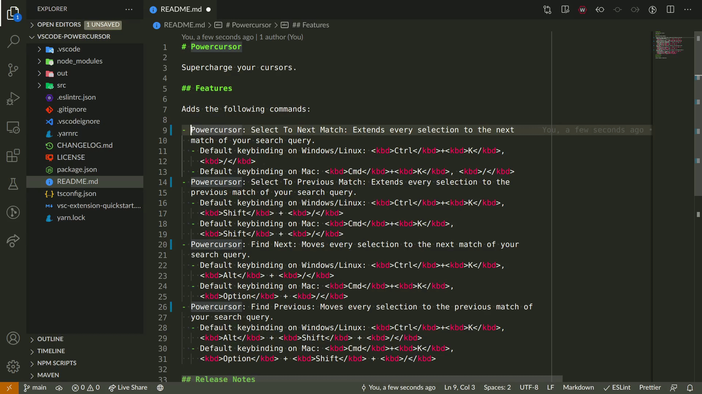

# Powercursor

Supercharge your cursors.

## Features

Adds the following commands:

- **Powercursor: Select To Next Match**: Extends every selection to the next
  match of your search query.
  - Default keybinding on Windows/Linux: <kbd>Ctrl</kbd>+<kbd>K</kbd>,
    <kbd>/</kbd>
  - Default keybinding on Mac: <kbd>Cmd</kbd>+<kbd>K</kbd>, <kbd>/</kbd>
- **Powercursor: Select To Previous Match**: Extends every selection to the
  previous match of your search query.
  - Default keybinding on Windows/Linux: <kbd>Ctrl</kbd>+<kbd>K</kbd>,
    <kbd>Shift</kbd> + <kbd>/</kbd>
  - Default keybinding on Mac: <kbd>Cmd</kbd>+<kbd>K</kbd>,
    <kbd>Shift</kbd> + <kbd>/</kbd>
- **Powercursor: Find Next**: Moves every selection to the next match of your
  search query.
  - Default keybinding on Windows/Linux: <kbd>Ctrl</kbd>+<kbd>K</kbd>,
    <kbd>Alt</kbd> + <kbd>/</kbd>
  - Default keybinding on Mac: <kbd>Cmd</kbd>+<kbd>K</kbd>,
    <kbd>Option</kbd> + <kbd>/</kbd>
- **Powercursor: Find Previous**: Moves every selection to the previous match of
  your search query.
  - Default keybinding on Windows/Linux: <kbd>Ctrl</kbd>+<kbd>K</kbd>,
    <kbd>Alt</kbd> + <kbd>Shift</kbd> + <kbd>/</kbd>
  - Default keybinding on Mac: <kbd>Cmd</kbd>+<kbd>K</kbd>,
    <kbd>Option</kbd> + <kbd>Shift</kbd> + <kbd>/</kbd>

## Release Notes

### v1.0.0

Initial release of Powercursor.

### v1.0.1

Set `extensionKind` so that Powercursor prefers to run as a UI extension.

### v1.0.2

Add support for VS Code for the Web.
